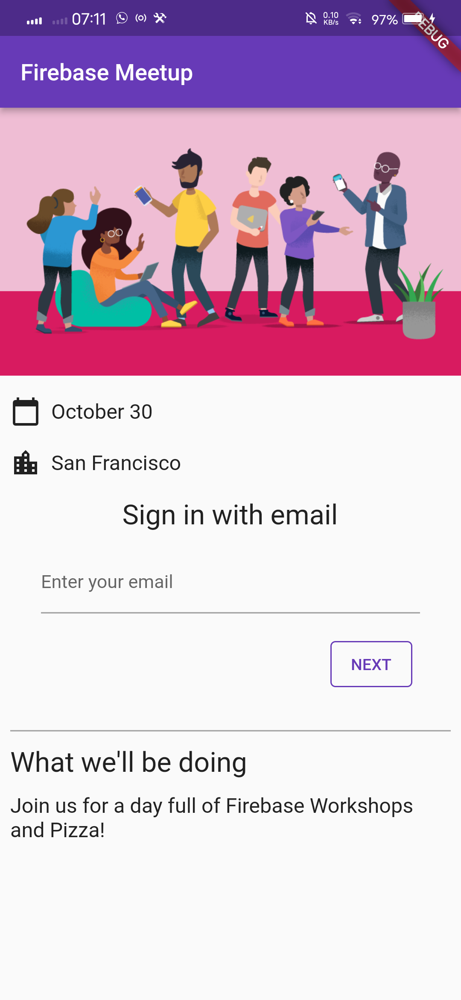

# firebase_part2

A new Flutter project.

## Dapatkan kode sampel


## Membuat Proyek Firebase
- Membuat proyek firebase dengan nama Firebase-Flutter-Codelab


- Mengaktifkan login email untuk Firebase Authentication


- Mengaktifkan cloud firestore


## Konfigurasi Firebase
- Konfigurasi dependensi
```
flutter pub add firebase_core 
flutter pub add firebase_auth
flutter pub add cloud_firestore
flutter pub add provider
```

- Memasang flutterfire
```
dart pub global activate flutterfire_cli
```

- Mengonfigurasi aplikasi Anda
```
flutterfire configure
```

## Tambahkan LoginPengguna (RSVP)


| Result | Description |
| --- | --- |
|  | Berikut merupakan halaman awal dari alur otentikasi. User dapat menekan tombol RSVP, untuk memulai formulir email. |
|  | Setelah memasukkan email, sistem mengkonfirmasi jika pengguna sudah terdaftar, dalam hal ini pengguna dimintai kata sandi, atau jika pengguna tidak terdaftar, maka mereka pergi melalui formulir pendaftaran. |
|  | Jika belum memiliki akun maka akan diminta untuk mengisi formulir create account. Masukkan email dan password|
|  | Ketika password kurang dari enam karakter maka akan muncul pemberitahuan bahwa password yang dimasukkan harus terdiri dari enam karakter atau lebih.|
|  | Masukkan email dan password sesuai dengan yang dibuat pada ceate account. |
|  | Halaman yang akan tampil ketika berhasil login |
|  | Ketika password yang dimasukkan salah maka akan muncul pemberitahuan bahwa password yang dimasukkan salah |

## Tulis Pesan ke Cloud Firestor

- Untuk mengirim pesan pastikan sudah masuk ke akun 
-  
- Coba untuk memasukkan pesan, disini saya mencoba memasukkan pesan "Hi!" 
-  
- Pesan yang berhasil dikirimkan akan tersimpan pada cloyd firestore, seperti gambar berikut 
-  

## Baca Pesan
- Pesan yang berhasil disimpan akan ditampilkan pada aplikasi 

